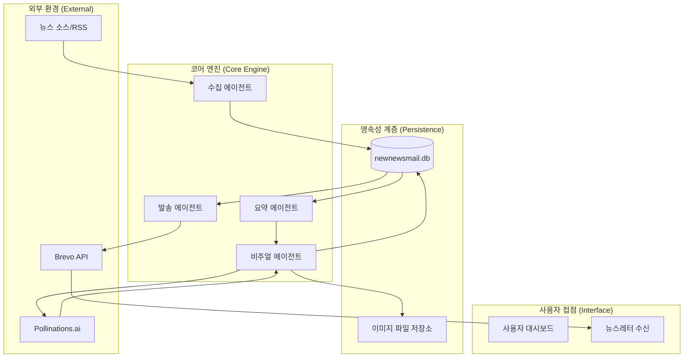

# 뉴뉴스메일(NewNewsMail) 시스템 설계 문서 v1.0

## 1. 개요
본 문서느 뉴뉴스메일 서비스의 전체 아키텍처와 데이터 흐름, 그리고 각 에이전트의 역할 및 상호작용 방식을 정의합니다.

### 1.1 설계 원칙
- **자율성(Autonomy)**: 각 에이전트는 독립적인 스킬 룰을 기반으로 판단하고 행동함
- **데이터 중심(Data-centric)**: 모든 에이전트의 활동은 DB에 기록되어 추적 및 검증 가능
- **가용성(Availability)**: 경량 스택과 자동화된 관리 태스크를 통한 무중단 운영 지향

## 2. 시스템 아키텍처

### 2.1 전체 서비스 흐름 (Agentic Flow)

## 3. 주요 구성 요소

### 3.1 에이전틱 파이프라인
1. **수집(Intake)**: 일정한 주기로 뉴스 소스를 분석하여 신규 정보를 DB에 적재. 중복 검출 및 메타데이터 정제 포함.
2. **가공(Summary)**: Gemini 1.5 Flash를 활용하여 '결론 우선' 방식의 3단계 요약문 생성.
3. **비주얼(Visual)**: 요약된 내용을 바탕으로 이미지 생성 프롬프트를 도출하고, Pollinations.ai에서 생성된 배경에 Pillow를 이용하여 타이틀 합성.
4. **발송(Dispatch)**: 사용자별 구독 등급 및 관심사를 반영하여 뉴스레터를 빌드하고 Brevo를 통해 발송.

### 3.2 가드레일 및 법적 준수 (Guardrails)
- **ConsentLogs**: 모든 마케팅 동의 및 철회 이력 보관.
- **Auto-Unsubscribe**: 로그인 없이 즉시 처리되는 수신 거부 로직.
- **Compliance Task**: 2년 주기 동의 확인 메일 자동 발송 스케줄러.

## 4. 데이터 저장소 설계
- **SQLite**: 단일 파일 기반으로 관리 편의성 극대화.
- **주요 테이블**: `ARTICLES`, `USER_CONSENT`, `EMAIL_SEND_LOGS`, `SUBSCRIPTIONS`. (상세 내용은 ERD 시각화 문서 참조)

## 5. 실행 가이드
- **백엔드**: `scripts/scheduler_agent.py` 실행을 통한 에이전트 기동.
- **프론트엔드**: Next.js 개발 서버 구동 (`npm run dev`).

---
**문서 버전**: v1.0 | **최종 업데이트**: 2026-02-24
